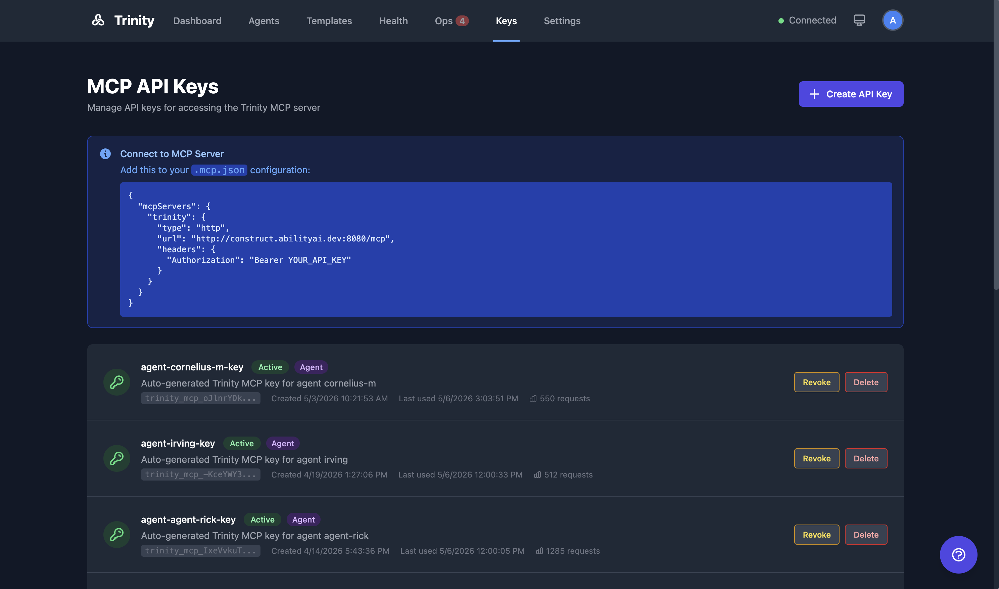

# MCP Server

Trinity's MCP server exposes 62 tools for agent orchestration via the Model Context Protocol, enabling programmatic control from Claude Code, other MCP clients, or agent-to-agent communication.

## Concepts

- **Model Context Protocol (MCP)** -- An open standard for tool-based AI integrations. Trinity implements an MCP server that exposes agent management as callable tools.
- **FastMCP** -- The server framework used, with Streamable HTTP transport on port 8080.
- **API Keys** -- Authentication mechanism for MCP access. Keys are generated in the API Keys page and sent via `Authorization: Bearer` header.
- **Agent-Scoped Keys** -- API keys that restrict access to a specific agent, limiting which tools and data the key holder can reach.

## How It Works

### Authentication



1. Go to the **API Keys** page (`/api-keys`).
2. Click **Create Key**. Optionally scope the key to a specific agent.
3. Copy the generated key (prefixed `trinity_mcp_*`).
4. Use the key as a Bearer token in the `Authorization` header.

### Connecting from Claude Code

Add Trinity as an MCP server in your Claude Code configuration:

```json
{
  "mcpServers": {
    "trinity": {
      "type": "url",
      "url": "http://localhost:8080/mcp",
      "headers": {
        "Authorization": "Bearer <your-api-key>"
      }
    }
  }
}
```

### Tool Categories

| Module | Tools | Description |
|--------|-------|-------------|
| `agents.ts` | 17 | Agent lifecycle, credentials, SSH, local deploy, GitHub sync |
| `chat.ts` | 3 | Chat, history, logs |
| `schedules.ts` | 8 | Schedule CRUD and execution history |
| `executions.ts` | 3 | Execution queries, async polling, activity monitoring |
| `skills.ts` | 7 | Skill management and assignment |
| `tags.ts` | 5 | Agent tagging |
| `systems.ts` | 4 | System manifest deployment |
| `subscriptions.ts` | 6 | Subscription management |
| `monitoring.ts` | 3 | Fleet health |
| `nevermined.ts` | 4 | Payment configuration |
| `notifications.ts` | 1 | Agent notifications |
| `events.ts` | 4 | Event pub/sub |
| `docs.ts` | 1 | Agent documentation |

## For Agents

### API Endpoints

| Endpoint | Method | Description |
|----------|--------|-------------|
| `/api/mcp/keys` | POST | Create API key |
| `/api/mcp/keys` | GET | List API keys |
| `/api/mcp/keys/{key_id}` | DELETE | Revoke API key |

### MCP Endpoint

| Endpoint | Transport | Description |
|----------|-----------|-------------|
| `http://localhost:8080/mcp` | Streamable HTTP | MCP tool server |

## Limitations

- API keys are invalidated when the backend restarts.
- Agent-scoped keys cannot access tools outside their assigned agent.
- MCP clients must be manually reconnected after a backend restart.

## See Also

- [Nevermined Payments](nevermined-payments.md)
- [Slack Integration](slack-integration.md)
